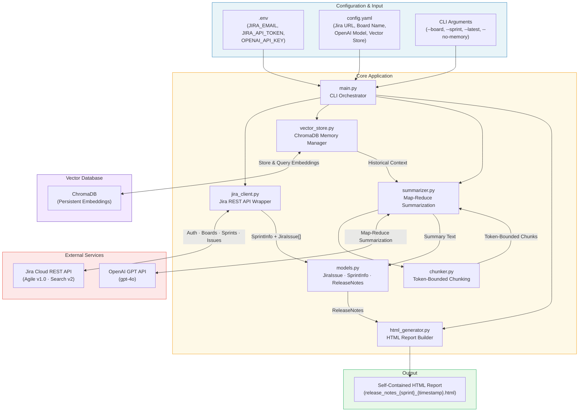
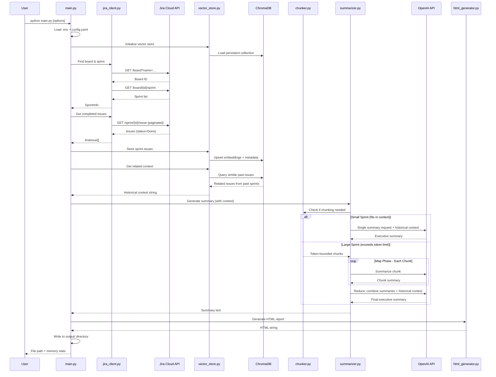
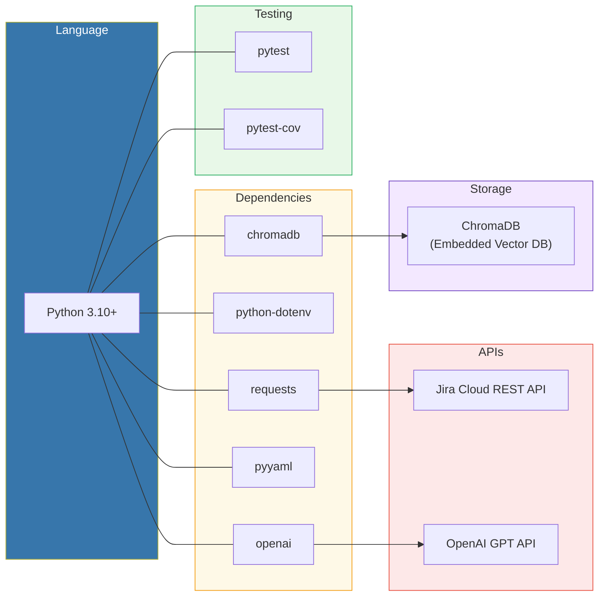

# JiraAgent - Capabilities & Architecture

## Overview

JiraAgent is a Python CLI application that automatically generates professional sprint release notes from Jira. It fetches completed issues from a sprint, generates an AI-powered executive summary with context-aware chunking, stores issues in a vector database for cross-sprint memory, and exports a self-contained HTML report.

---

## Architecture



---

## Data Flow



---

## Chunking Strategy

```mermaid
flowchart LR
    subgraph Input["Issue Data"]
        ISSUES["issues_by_type\n{Story: [...], Bug: [...], Task: [...]}"]
    end

    subgraph Estimate["Token Estimation"]
        EST["estimate_tokens()\n~4 chars per token"]
    end

    subgraph Decision{"Needs Chunking?"}
        CHECK{"Total tokens\n> chunk_limit?"}
    end

    subgraph Direct["Direct Path"]
        SINGLE["Single LLM Call\n+ historical context"]
    end

    subgraph MapReduce["Map-Reduce Path"]
        SPLIT["chunk_issues()\nSplit by type boundaries\nthen by token limit"]
        MAP["Map Phase\nSummarize each chunk"]
        REDUCE["Reduce Phase\nCombine chunk summaries\n+ historical context"]
    end

    subgraph Final["Output"]
        SUMMARY["Executive Summary"]
    end

    ISSUES --> EST --> CHECK
    CHECK -->|No| SINGLE --> SUMMARY
    CHECK -->|Yes| SPLIT --> MAP --> REDUCE --> SUMMARY

    style Input fill:#e8f4f8,stroke:#2980b9
    style MapReduce fill:#fef9e7,stroke:#f39c12
    style Final fill:#e8f8e8,stroke:#27ae60
```

---

## Capabilities

### Jira Integration
| Capability | Details |
|---|---|
| Board Discovery | Find Jira boards by name |
| Sprint Listing | List active, closed, and future sprints |
| Sprint Selection | Interactive prompt, `--latest` auto-select, or `--sprint` by name |
| Issue Fetching | Retrieve all completed (Done) issues from a sprint |
| Pagination | Handles large sprints (500+ issues) transparently |
| Rate Limiting | Automatic retry with exponential backoff (up to 3 attempts) |
| Timeout Handling | Connection (10s) and read (30s) timeouts |

### Vector Memory (ChromaDB)
| Capability | Details |
|---|---|
| Persistent Storage | Issues stored as embeddings in local ChromaDB database |
| Cross-Sprint Memory | Recall similar issues from previous sprints |
| Historical Context | Enrich summaries with trends and recurring themes |
| Sprint History | Track issue counts and type breakdowns across sprints |
| Similarity Search | Cosine similarity search for related past work |
| Upsert Semantics | Re-running a sprint updates rather than duplicates |
| Configurable | Enable/disable via config or `--no-memory` flag |

### Context-Aware Chunking
| Capability | Details |
|---|---|
| Token Estimation | Fast character-based token estimation (~4 chars/token) |
| Type-Aware Splitting | Keeps issue types together when possible |
| Token-Bounded Chunks | Each chunk fits within configurable token limit (default: 3000) |
| Map-Reduce Summarization | Summarize chunks independently, then combine |
| Automatic Detection | Only chunks when data exceeds context limits |
| Metadata Preservation | Labels, priority, assignee carried through chunks |

### AI Summarization
| Capability | Details |
|---|---|
| Executive Summary | 2-3 paragraph business-focused summary via OpenAI GPT |
| Model Support | Configurable model (default: gpt-4o) |
| Direct Mode | Single LLM call for small sprints |
| Map-Reduce Mode | Multi-step summarization for large sprints |
| Historical Enrichment | Context from past sprints informs summary |
| Graceful Fallback | Count-based summary when OpenAI is unavailable |
| Structured Prompts | Consistent, professional output across sprints |

### Report Generation
| Capability | Details |
|---|---|
| Self-Contained HTML | Single file with embedded CSS, no external dependencies |
| Issue Grouping | Organized by type (Story, Bug, Task, Epic, etc.) |
| Color Coding | Visual indicators for issue types and priorities |
| Stats Bar | At-a-glance issue type breakdown |
| Sortable Tables | Columns: Key, Summary, Assignee, Priority, Status |
| Responsive Design | Clean typography, works across screen sizes |
| XSS Protection | All user content HTML-escaped |

### CLI Interface
| Capability | Details |
|---|---|
| Interactive Mode | Prompts for sprint selection with auto-detection |
| Non-Interactive Mode | `--latest` and `--sprint` flags for automation |
| Board Override | `--board` flag to override config default |
| Memory Control | `--no-memory` flag to disable vector store |
| Configuration | YAML config file + `.env` for secrets |
| Error Messages | User-friendly output for common failure modes |

---

## Tech Stack



---

## Project Structure

```
JiraAgent/
├── main.py              # CLI entry point & orchestration
├── jira_client.py       # Jira REST API wrapper
├── summarizer.py        # Map-reduce summarization engine
├── chunker.py           # Token-bounded text chunking
├── vector_store.py      # ChromaDB vector memory manager
├── html_generator.py    # HTML report generation
├── models.py            # Data classes (JiraIssue, SprintInfo, ReleaseNotes)
├── config.yaml.example  # Configuration template
├── .env.example         # Environment secrets template
├── requirements.txt     # Python dependencies
├── data/
│   └── vectordb/        # ChromaDB persistent storage (gitignored)
├── tests/
│   ├── conftest.py          # Shared fixtures & factories
│   ├── test_main.py         # CLI & orchestration tests
│   ├── test_jira_client.py  # API wrapper tests
│   ├── test_summarizer.py   # Summarization tests
│   ├── test_chunker.py      # Chunking logic tests
│   ├── test_vector_store.py # Vector store tests
│   ├── test_html_generator.py # HTML generation tests
│   ├── test_integration.py  # End-to-end pipeline tests
│   └── test_models.py       # Data model tests
└── output/              # Generated reports (gitignored)
```

---

## Quick Start

```bash
# 1. Install dependencies
pip install -r requirements.txt

# 2. Configure
cp config.yaml.example config.yaml   # Edit with your Jira URL
cp .env.example .env                  # Add your credentials

# 3. Run (with vector memory enabled by default)
python main.py --board "My Board" --latest

# 4. Run without memory
python main.py --board "My Board" --latest --no-memory
```
